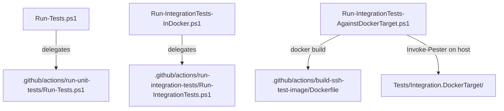

# Plan: Docker Integration Tests

## Index

- [Steps](#steps)
  - [1. SSH test image](#1-ssh-test-image)
  - [2. Docker host reusable workflow](#2-docker-host-reusable-workflow)
  - [3. Docker target reusable workflow](#3-docker-target-reusable-workflow)
  - [4. Consumer repo wrappers](#4-consumer-repo-wrappers)
  - [5. Manual runner scripts](#5-manual-runner-scripts)

See [problem.md](problem.md) for context.

---

## Steps

### 1. SSH test image

**Why:** A shared, cached Dockerfile keeps the SSH target image definition in
one place. GHA layer caching eliminates the `apt-get` penalty on every run.

**Files:**
- `.github/actions/build-ssh-test-image/Dockerfile` - Ubuntu 24.04 with
  openssh-server and sudo; generates host keys at build time.
- `.github/actions/build-ssh-test-image/action.yml` - composite action;
  uses `docker/setup-buildx-action` + `docker/build-push-action` with
  `cache-from/cache-to: type=gha`.

**Tests:** SSH container starts and accepts connections on port 2222.

---

### 2. Docker host reusable workflow

**Why:** Centralises the "run tests inside a container" pattern so consumer
repos need only a thin local wrapper.

**Files:**
- `.github/actions/run-integration-tests/Run-IntegrationTests.ps1` -
  discovers `Tests/Integration.DockerHost/*.Tests.ps1`, runs each in its
  own `mcr.microsoft.com/powershell` container. Accepts `DockerImage` to
  pin a specific Ubuntu variant.
- `.github/actions/run-integration-tests/action.yml` - composite action
  wrapper.
- `.github/workflows/ci-powershell-docker-host.yml` - reusable workflow;
  job display name `Integration (PowerShell 7) - Docker host tests`.

**Tests:** Integration test files under `Tests/Integration.DockerHost/` pass
inside the container.

---

### 3. Docker target reusable workflow

**Why:** The SSH-based test pattern (host runs tests, Docker is the SSH
target) requires a different workflow: build the image first, then run
Pester directly on the hosted runner.

**Files:**
- `.github/actions/build-ssh-test-image/action.yml` - composite action;
  builds the SSH target image with GHA layer caching (Dockerfile defined
  in step 1).
- `.github/workflows/ci-powershell-docker-target.yml` - reusable workflow;
  builds image, installs Pester on the hosted runner, runs
  `Tests/Integration.DockerTarget/` on the host. Job display name
  `Integration (PowerShell 7) - Docker host SSH target`.

**Tests:** SSH integration tests in the consumer repo pass end-to-end.

---

### 4. Consumer repo wrappers

**Why:** GitHub Actions requires a local workflow file for `pull_request`
triggers and `workflow_call` references. The consumer file is kept minimal -
it only delegates to the reusable workflow.

**Files per consumer repo:**
- `ci-docker-host.yml` - job id `ci-docker-host`, calls
  `ci-powershell-docker-host.yml@master`. Repos: Vm-Users, Secrets,
  Vm-Provisioner, E2E.
- `ci-docker-target.yml` - job id `ci-docker-target`, calls
  `ci-powershell-docker-target.yml@master`. Repos: GitHubRunners.

**Tests:** PRs in consumer repos trigger the correct reusable workflow and
status checks report under the expected context name.

---

### 5. Manual runner scripts

**Why:** Developers need to run the same test pipelines locally without
understanding the CI internals.

**Affected components:**

**Files:**
- `Run-Tests.ps1` - delegates to the run-unit-tests action script.
- `Run-IntegrationTests-InDocker.ps1` - delegates to
  `run-integration-tests/Run-IntegrationTests.ps1`; accepts `DockerImage`.
- `Run-IntegrationTests-AgainstDockerTarget.ps1` - builds the SSH image if
  absent, installs Pester on the host, runs `Tests/Integration.DockerTarget/`
  directly.
  Accepts `TestsRoot` so consumer repos can call it with their own root:
  `.ci-common\Run-IntegrationTests-AgainstDockerTarget.ps1 -TestsRoot $PSScriptRoot`

**Tests:** Each script produces the same result as its CI counterpart when
run locally with Docker available.
