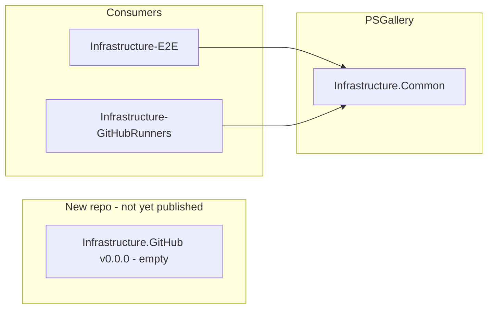
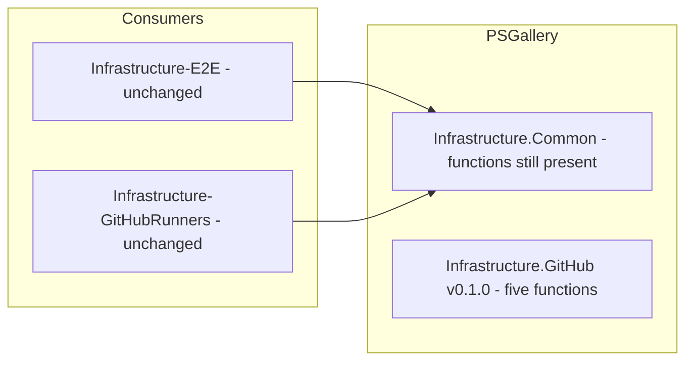
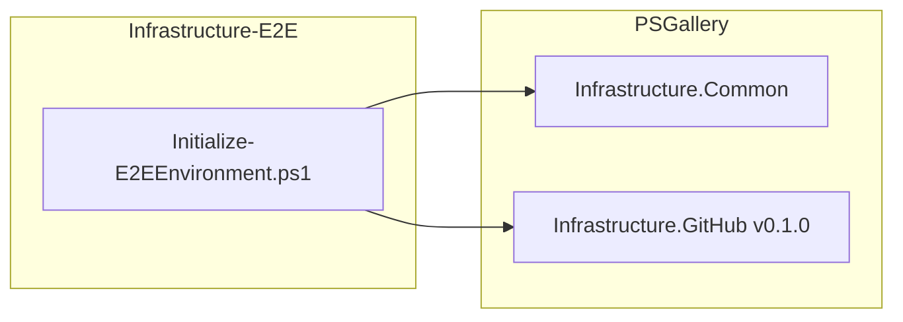
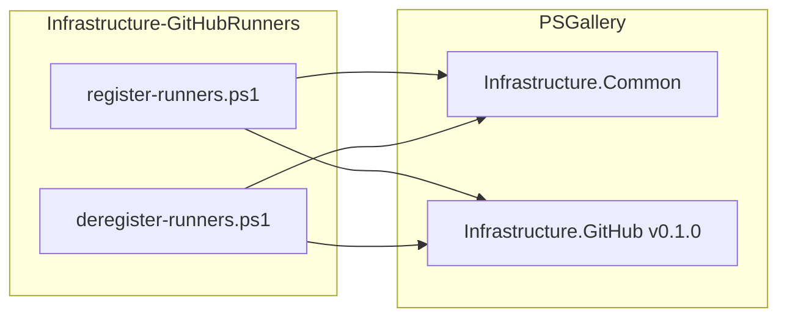
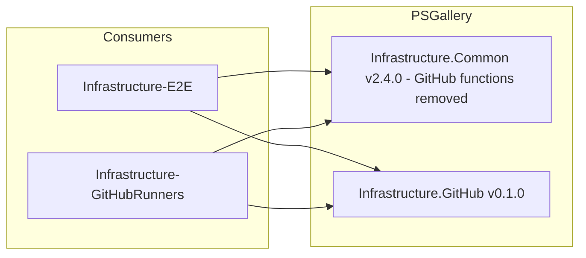

# Plan: Extract Infrastructure.GitHub

See [problem.md](problem.md) for context.

## Index
- [Step 1 - Infrastructure.GitHub repo scaffold](#step-1---infrastructuregithub-repo-scaffold)
- [Step 2 - Populate Infrastructure.GitHub with the five functions](#step-2---populate-infrastructuregithub-with-the-five-functions)
- [Step 3 - Update Infrastructure-E2E](#step-3---update-infrastructure-e2e)
- [Step 4 - Update Infrastructure-GitHubRunners](#step-4---update-infrastructure-githubrunners)
- [Step 5 - Remove GitHub functions from Infrastructure.Common](#step-5---remove-github-functions-from-infrastructurecommon)

---

## Step 1 - Infrastructure.GitHub repo scaffold

**Reason**: The new module needs a home before any functions move into it.
Establishing the scaffold first means steps 2-5 are purely additive moves with
no structural unknowns left to resolve mid-migration.

**What**: New GitHub repository `Infrastructure.GitHub` with the same layout
conventions as `Infrastructure.Common`. CI workflows delegate to Common's
reusable workflows; manual test runners delegate to Common scripts via a
`.ci-common` checkout (same pattern used by other consumer repos).

```
Infrastructure.GitHub/
  Infrastructure.GitHub/
    Infrastructure.GitHub.psd1      # ModuleVersion 0.0.0, no RequiredModules
    Infrastructure.GitHub.psm1      # dot-sources Public\*.ps1, Export-ModuleMember
    Public/                         # (empty - populated in Step 2)
  Tests/                            # (empty - populated in Step 2)
  .github/
    workflows/
      ci.yml                        # calls Common's ci-powershell.yml
      ci-docker-host.yml            # calls Common's ci-powershell-docker-host.yml
      ci-docker-target.yml          # calls Common's ci-powershell-docker-target.yml
      release.yml                   # version check -> all three CI ->
                                    #   tag (Common) -> publish (Common)
      publish.yml                   # workflow_dispatch wrapper -> Common's publish.yml
  Run-Tests.ps1                     # delegates to .ci-common/.github/actions/...
  Run-IntegrationTests-InDocker.ps1
  Run-IntegrationTests-AgainstDockerTarget.ps1
```

### CI workflows

The three CI workflows are thin callers of Common's reusable workflows
(`workflow_call`). No CI logic is duplicated:

```yaml
# ci.yml
jobs:
  ci:
    uses: VitaliiAndreev/Infrastructure-Common/.github/workflows/ci-powershell.yml@master

# ci-docker-host.yml
jobs:
  ci:
    uses: VitaliiAndreev/Infrastructure-Common/.github/workflows/ci-powershell-docker-host.yml@master

# ci-docker-target.yml
jobs:
  ci:
    uses: VitaliiAndreev/Infrastructure-Common/.github/workflows/ci-powershell-docker-target.yml@master
```

`release.yml` follows Secrets' `release.yml` pattern exactly, with two
substitutions:
- path trigger: `Infrastructure.GitHub/Infrastructure.GitHub.psd1`
- `psd1` / `module-path` arguments pointing to `Infrastructure.GitHub`

The `tag` and `publish` jobs in `release.yml` call Common's reusable workflows
directly - no local copies:

```yaml
tag:
  uses: VitaliiAndreev/Infrastructure-Common/.github/workflows/tag.yml@master
  with:
    psd1: 'Infrastructure.GitHub\Infrastructure.GitHub.psd1'

publish:
  uses: VitaliiAndreev/Infrastructure-Common/.github/workflows/publish.yml@master
  with:
    module-path: Infrastructure.GitHub
  secrets:
    PSGALLERY_API_KEY: ${{ secrets.PSGALLERY_API_KEY }}
```

The local `publish.yml` is a thin `workflow_dispatch` wrapper (same as Secrets)
so manual publishes can be triggered from this repo's Actions tab. No local
`tag.yml` is needed.

### Manual test runners

All three runners assume Common is checked out at `.ci-common` (one-time
`git clone`). This is the same convention used by Infrastructure-GitHubRunners
and Infrastructure-E2E:

```powershell
# Run-Tests.ps1
& .ci-common/.github/actions/run-unit-tests/Run-Tests.ps1 -TestsRoot $PSScriptRoot

# Run-IntegrationTests-InDocker.ps1
& .ci-common/.github/actions/run-integration-tests/Run-IntegrationTests.ps1 `
    -TestsRoot $PSScriptRoot

# Run-IntegrationTests-AgainstDockerTarget.ps1
& .ci-common/Run-IntegrationTests-AgainstDockerTarget.ps1 -TestsRoot $PSScriptRoot
```

The psd1 starts at `0.0.0` with an empty `FunctionsToExport`. No functions are
published yet - that happens in Step 2.

**Tests**: Common's `Module.Tests.ps1` runs automatically via `.ci-common` - no
local copy needed. With `Public/` empty it trivially passes:
- All `Public\*.ps1` files appear in `FunctionsToExport`.
- All `Public\*.ps1` files are dot-sourced in the psm1.
- All `Public\*.ps1` files appear in `Export-ModuleMember`.



---

## Step 2 - Populate Infrastructure.GitHub with the five functions

**Reason**: All five functions are moved together because they form a single
cohesive surface - splitting the migration across multiple steps would leave
Infrastructure.GitHub in a partially useful state and require consumers to
upgrade twice. Functions are **added to GitHub first without removing from
Common** - consumers continue to work unchanged throughout this step.

**What**: Copy five functions and their test files from Common into
Infrastructure.GitHub.

| Function | Source file (Common) | Destination (GitHub) |
|---|---|---|
| `Invoke-GitHubApi` | `Public/Invoke-GitHubApi.ps1` | `Public/Invoke-GitHubApi.ps1` |
| `Get-GitHubAppToken` | `Public/Get-GitHubAppToken.ps1` | `Public/Get-GitHubAppToken.ps1` |
| `Get-PendingDeployment` | `Public/Get-PendingDeployment.ps1` | `Public/Get-PendingDeployment.ps1` |
| `Set-DeploymentStatus` | `Public/Set-DeploymentStatus.ps1` | `Public/Set-DeploymentStatus.ps1` |
| `Invoke-RunnerTarballEnsure` | `Public/Invoke-RunnerTarballEnsure.ps1` | `Public/Invoke-RunnerTarballEnsure.ps1` |

Tests are copied verbatim - the dot-source path changes from
`Infrastructure.Common/Public/...` to `Infrastructure.GitHub/Public/...` but
the test bodies are identical.

`Infrastructure.GitHub.psd1` and `Infrastructure.GitHub.psm1` are updated to
declare and dot-source all five functions. Version bumped to `0.1.0` and
published to PSGallery.

**Infrastructure.Common is not changed in this step.** Both modules export the
same functions temporarily; consumers resolve whichever they have installed.

**Tests** (in Infrastructure.GitHub - identical assertions to Common originals):
- `Tests/Invoke-GitHubApi.Tests.ps1`
- `Tests/Get-GitHubAppToken.Tests.ps1`
- `Tests/Get-PendingDeployment.Tests.ps1`
- `Tests/Set-DeploymentStatus.Tests.ps1`
- `Tests/Invoke-RunnerTarballEnsure.Tests.ps1`



---

## Step 3 - Update Infrastructure-E2E

**Reason**: E2E is updated before GitHubRunners because it has broader coverage
of the GitHub functions (deployment lifecycle + runner tarball) and will
surface any integration issues before the production provisioning path is
touched. Updating consumers before removing from Common keeps the system
working at every commit.

**What**: Changes in `Infrastructure-E2E`.

### `Initialize-E2EEnvironment.ps1`
Add `Invoke-ModuleInstall -ModuleName 'Infrastructure.GitHub' -MinimumVersion '0.1.0'`
after the existing `Infrastructure.Common` install. No other changes - all
call sites (`Invoke-GitHubApi`, `Get-GitHubAppToken`, etc.) remain identical.

### `Invoke-RunnerTarballPrefetch.ps1`
No change to the function body. The `Invoke-RunnerTarballEnsure` call resolves
from Infrastructure.GitHub once that module is installed.

**Tests**: All existing E2E tests pass unchanged. No new tests needed - this
step is a dependency wiring change, not a logic change.



---

## Step 4 - Update Infrastructure-GitHubRunners

**Reason**: Mirrors Step 3 for the production runner registration path. Done
after E2E to reduce risk - E2E failures are non-production.

**What**: Changes in `Infrastructure-GitHubRunners`.

### `register-runners.ps1`
Add `Invoke-ModuleInstall -ModuleName 'Infrastructure.GitHub' -MinimumVersion '0.1.0'`
after the existing `Infrastructure.Common` install block.

### `deregister-runners.ps1`
Same addition if it installs Infrastructure.Common (check and mirror).

No call-site changes in any dot-sourced helper - `Invoke-GitHubApi`,
`Invoke-RunnerTarballEnsure` etc. resolve from Infrastructure.GitHub once
installed.

**Tests**: All existing unit tests pass unchanged.



---

## Step 5 - Remove GitHub functions from Infrastructure.Common

**Reason**: With both consumers using Infrastructure.GitHub, the functions in
Common are dead weight. Removing them completes the migration and restores the
correct cohesion boundary. Done last to guarantee no consumer is broken by the
removal.

**What**: Changes in `Infrastructure.Common`.

Remove from `Infrastructure.Common/`:
- `Public/Invoke-GitHubApi.ps1`
- `Public/Get-GitHubAppToken.ps1`
- `Public/Get-PendingDeployment.ps1`
- `Public/Set-DeploymentStatus.ps1`
- `Public/Invoke-RunnerTarballEnsure.ps1`

Remove from `Tests/`:
- `Invoke-GitHubApi.Tests.ps1`
- `Get-GitHubAppToken.Tests.ps1`
- `Get-PendingDeployment.Tests.ps1`
- `Set-DeploymentStatus.Tests.ps1`
- `Invoke-RunnerTarballEnsure.Tests.ps1`

Update `Infrastructure.Common.psd1`:
- Remove the five names from `FunctionsToExport`.
- Bump `ModuleVersion` to next minor (e.g. `2.4.0`).

Update `Infrastructure.Common.psm1`:
- Remove the five dot-source lines.
- Remove the five names from `Export-ModuleMember`.
- Remove the five entries from the description block.

Publish updated Common to PSGallery.

**Tests**: All remaining Common tests pass. `Module.Tests.ps1` passes with the
reduced function list.


