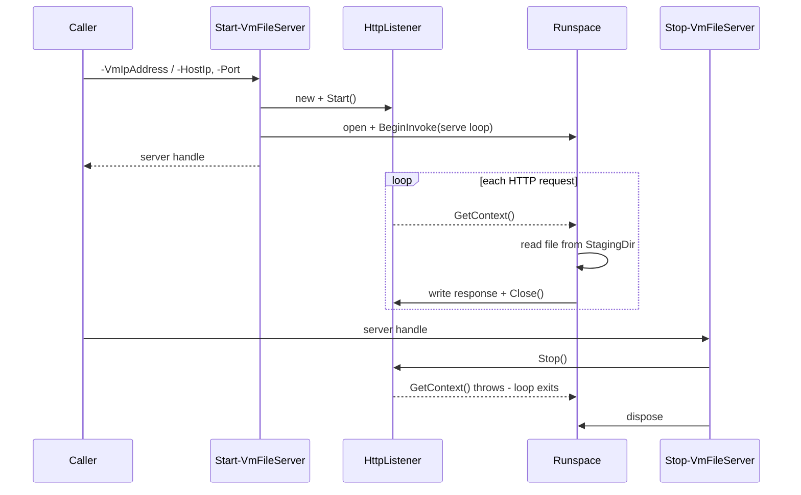
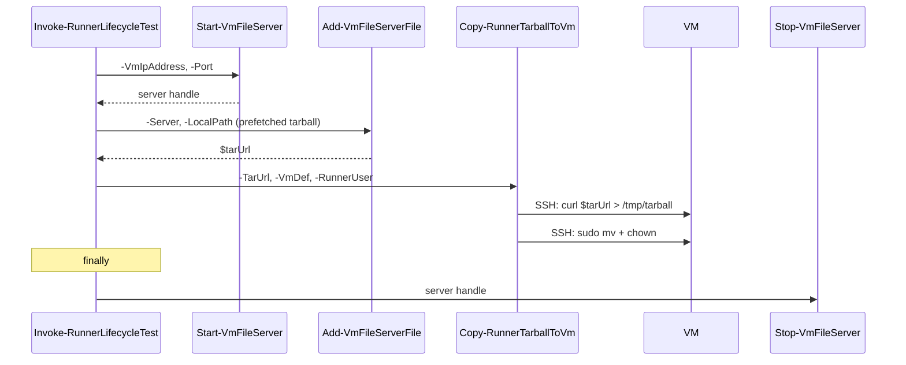

# Plan: Host-to-VM File Transfer

See [problem.md](problem.md) for context.

## Index
- [Step 1 - `Get-VmSwitchHostIp` in Infrastructure.Common](#step-1---get-vmswitchhostip-in-infrastructurecommon)
- [Step 2 - `Start-VmFileServer` / `Stop-VmFileServer` in Infrastructure.Common](#step-2---start-vmfileserver--stop-vmfileserver-in-infrastructurecommon)
- [Step 3 - `Add-VmFileServerFile` in Infrastructure.Common](#step-3---add-vmfileserverfile-in-infrastructurecommon)
- [Step 4 - Host server support in Infrastructure-GitHubRunners](#step-4---host-server-support-in-infrastructure-githubrunners)
- [Step 5 - Host server support in Infrastructure-E2E](#step-5---host-server-support-in-infrastructure-e2e)

---

## Step 1 - `Get-VmSwitchHostIp` in Infrastructure.Common

**Reason**: All callers need to find the Windows host's IP on the internal Hyper-V
switch to construct the server URL. Centralising this avoids repeated prefix-matching
logic spread across three repos.

**What**: New public function in `Infrastructure.Common/Public/Get-VmSwitchHostIp.ps1`.
Given any VM IP address on the switch, finds the host adapter's IP in the same /24
by scanning `Get-NetIPAddress` for a matching prefix.

```powershell
# Returns the host's IP on the same /24 as the VM, or throws if none found.
Get-VmSwitchHostIp -VmIpAddress '10.10.0.50'
# -> '10.10.0.1'
```

**Tests**: `Tests/Get-VmSwitchHostIp.Tests.ps1`
- Returns the matching adapter IP when one exists in the same /24.
- Throws when no adapter IP shares the prefix.
- Excludes the VM's own IP from candidates.

---

## Step 2 - `Start-VmFileServer` / `Stop-VmFileServer` in Infrastructure.Common

**Reason**: The persistent HTTP server is the core primitive. Everything else builds
on it. Isolating it in Common makes it independently testable and reusable.

**What**: Two new public functions.

`Start-VmFileServer` in `Infrastructure.Common/Public/Start-VmFileServer.ps1`:
- Calls `Get-VmSwitchHostIp` to find the host IP, or accepts an explicit `-HostIp`.
- Creates a temp staging directory.
- Starts `System.Net.HttpListener` bound to `http://<hostIp>:<port>/`.
- Opens a Windows Firewall inbound rule for the port.
- Spawns a background runspace with a `GetContext()` loop that serves files from the
  staging directory. Responds 200 with file bytes, 404 for missing files.
- Returns a server handle (`[PSCustomObject]`) with: `HostIp`, `Port`, `BaseUrl`,
  `StagingDir`, `Listener`, `Runspace`, `PowerShell`, `FirewallRuleName`.

`Stop-VmFileServer` in `Infrastructure.Common/Public/Stop-VmFileServer.ps1`:
- Calls `$Server.Listener.Stop()` - this causes `GetContext()` to throw, exiting the
  background loop cleanly.
- Disposes the runspace and PowerShell instance.
- Removes the firewall rule.
- Deletes the staging directory.

Both callers must wrap `Start-VmFileServer` / `Stop-VmFileServer` in try/finally so
the server always stops even if subsequent steps fail.

**Tests**: `Tests/Start-VmFileServer.Tests.ps1`, `Tests/Stop-VmFileServer.Tests.ps1`
- Integration: start server, fetch a file placed in staging dir via `Invoke-WebRequest`
  to `http://127.0.0.1:<port>/file`, verify bytes match.
- Integration: verify 404 response for a missing file.
- Unit: `Stop-VmFileServer` calls `Listener.Stop()` and removes the firewall rule.
- `New-NetFirewallRule` / `Remove-NetFirewallRule` are mocked in unit tests.



---

## Step 3 - `Add-VmFileServerFile` in Infrastructure.Common

**Reason**: Callers hold files in various locations (prefetch cache, arbitrary paths).
A single helper copies the file into the server's staging directory and returns the
URL, so callers don't construct paths manually.

**What**: New public function in `Infrastructure.Common/Public/Add-VmFileServerFile.ps1`.

```powershell
# Copies $LocalPath to the server's staging directory (idempotent - skips
# copy if an identical file is already staged). Returns the download URL.
$url = Add-VmFileServerFile -Server $server -LocalPath 'E:\cache\tarball.tar.gz'
# -> 'http://10.10.0.1:8745/tarball.tar.gz'
```

Idempotent: if the file already exists in staging with the same size, the copy is
skipped. This handles re-runs without re-copying 225 MB.

**Tests**: `Tests/Add-VmFileServerFile.Tests.ps1`
- Copies the file to `Server.StagingDir` when not already present.
- Skips the copy when an identical file (same name, same size) is already staged.
- Returns `"$($Server.BaseUrl)/<filename>"`.
- Throws when `$LocalPath` does not exist.

---

## Step 4 - Host server support in Infrastructure-GitHubRunners

**Reason**: Replaces the in-VM `curl`-from-GitHub path with a host-served download,
eliminating the NAT bottleneck in production runner registration.

**What**: Changes across four files in `Infrastructure-GitHubRunners`.

### `Invoke-TarballDownload`
Add optional `[string] $HostBaseUrl = ''` parameter. When provided:
- Constructs `$tarUrl = "${HostBaseUrl}/${tarball}"` instead of the GitHub URL.
- Replaces `sudo -u $RunnerUser curl ... '$tarUrl'` - same curl command, different URL.
- The GitHub URL remains the fallback when `$HostBaseUrl` is empty (backward compat).

### `Invoke-RunnerInstall`
Add optional `[string] $HostBaseUrl = ''` and forward to `Invoke-TarballDownload`.

### `Invoke-VmRunnerGroup`
Add optional `[string] $HostBaseUrl = ''` and forward to `Invoke-RunnerInstall`.

### `register-runners.ps1`
Before the per-VM SSH loop:
1. Find host IP from any reachable VM's `ipAddress`.
2. `$server = Start-VmFileServer -VmIpAddress $hostIp -Port 8745`
3. `$tarUrl  = Add-VmFileServerFile -Server $server -LocalPath <prefetched tarball>`
4. Pass `$server.BaseUrl` to `Invoke-VmRunnerGroup`.

Wrap the VM loop and server in try/finally so `Stop-VmFileServer` always runs.

The prefetched tarball path is derived the same way E2E derives it:
`Invoke-RunnerTarballPrefetch` already exists in E2E; extract its path-construction
logic into a shared helper or replicate the convention in `register-runners.ps1`.

**Tests**:
- `Invoke-TarballDownload.Tests.ps1`: when `$HostBaseUrl` is set, curl uses the host
  URL not the GitHub URL. When empty, GitHub URL is used. (Mock `Invoke-SshClientCommand`.)
- `Invoke-RunnerInstall.Tests.ps1`: `$HostBaseUrl` is forwarded.
- `Invoke-VmRunnerGroup.Tests.ps1`: `$HostBaseUrl` is forwarded.

---

## Step 5 - Host server support in Infrastructure-E2E

**Reason**: Replaces the one-shot raw-TCP implementation with the shared server, giving
E2E the same reliable path as production and removing duplicated transfer logic.

**What**: Changes across two files in `Infrastructure-E2E`.

### `Copy-RunnerTarballToVm`
The function body is replaced: instead of managing a TCP server, it SSHes into the VM
and runs:
```bash
curl -fsSL -o '<remoteDest>' '<tarUrl>'
sudo mkdir -p '<remoteCache>'
sudo mv '<remoteTmp>' '<remoteDest>'
sudo chown '<RunnerUser>:<RunnerUser>' '<remoteDest>'
```
The `$TarUrl` parameter replaces `$LocalPath`. The function no longer manages a TCP
server, firewall rules, or a background job - all of that is the caller's concern.

New signature:
```powershell
Copy-RunnerTarballToVm -TarUrl <string> -VmDef <PSCustomObject> -RunnerUser <string>
```

### `Invoke-RunnerLifecycleTest.ps1`
Before calling `Copy-RunnerTarballToVm`:
1. `$server = Start-VmFileServer -VmIpAddress $VmDef.ipAddress -Port 8745`
2. `$tarUrl  = Add-VmFileServerFile -Server $server -LocalPath <prefetched tarball>`
3. `Copy-RunnerTarballToVm -TarUrl $tarUrl -VmDef $VmDef -RunnerUser $RunnerUser`

Wrap in try/finally so `Stop-VmFileServer` always runs.

**Tests**:
- `Copy-RunnerTarballToVm`: mock `Invoke-SshClientCommand`; verify correct `curl` and
  `mv`/`chown` commands are sent with the provided `$TarUrl`.
- `Invoke-RunnerLifecycleTest.ps1`: mock `Start-VmFileServer`, `Add-VmFileServerFile`,
  `Stop-VmFileServer`, `Copy-RunnerTarballToVm`; verify server is started before copy
  and stopped in finally.


