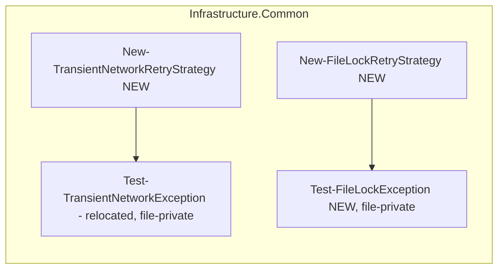
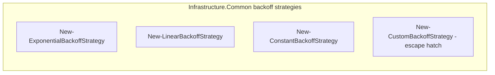
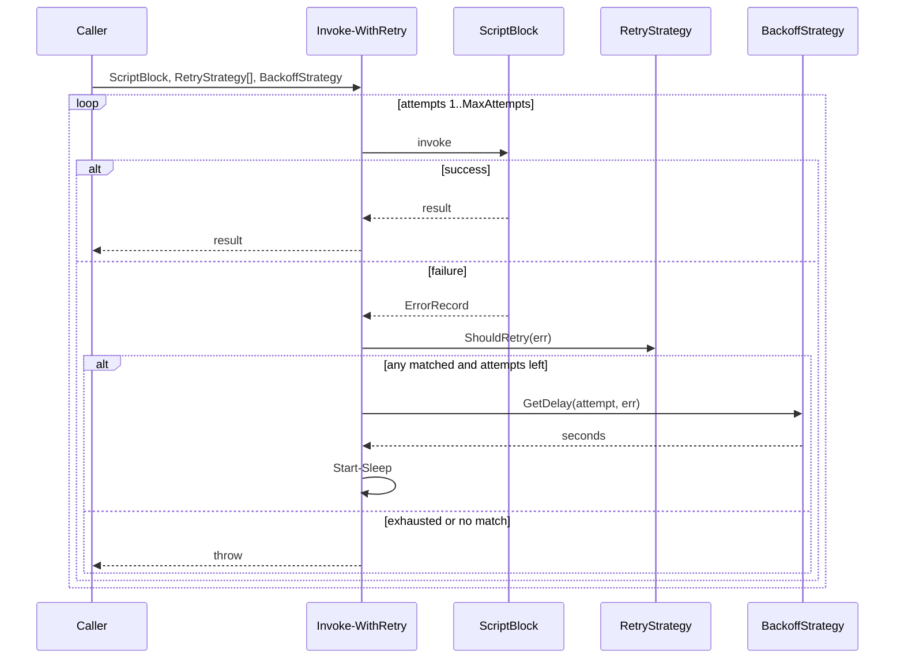
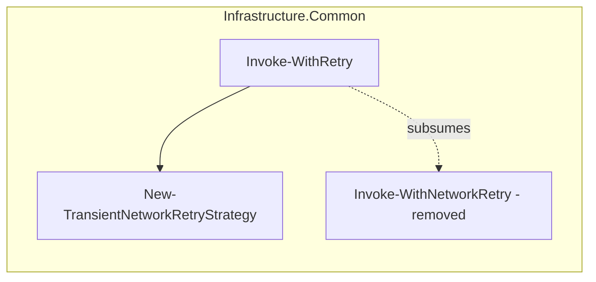
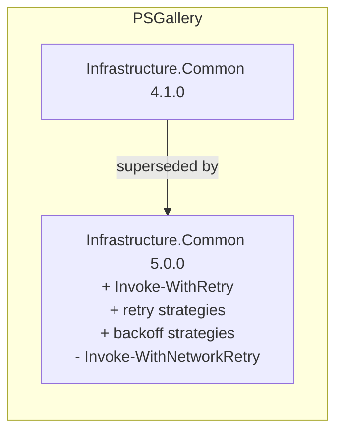
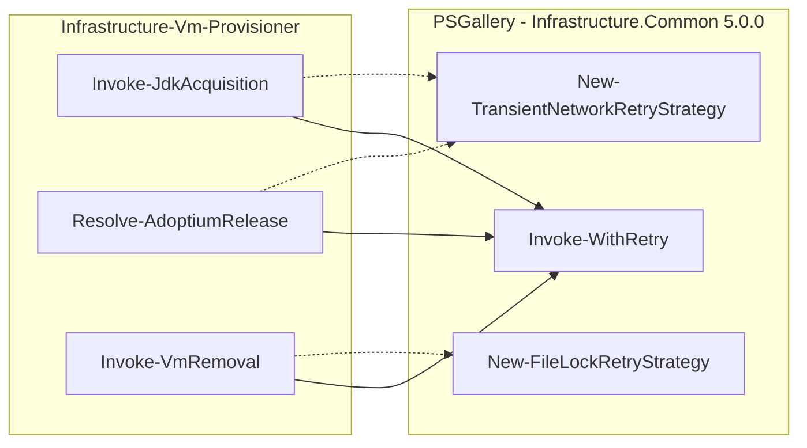

# Plan: Generalise retry

See [problem.md](problem.md) for context.

## Index
- [Folder layout](#folder-layout)
- [Strategy shape](#strategy-shape)
- [Step 1 - Add retry (predicate) strategies](#step-1---add-retry-predicate-strategies)
- [Step 2 - Add backoff strategies](#step-2---add-backoff-strategies)
- [Step 3 - Add Invoke-WithRetry generic primitive](#step-3---add-invoke-withretry-generic-primitive)
- [Step 4 - Remove Invoke-WithNetworkRetry from Infrastructure.Common](#step-4---remove-invoke-withnetworkretry-from-infrastructurecommon)
- [Step 5 - Publish Infrastructure.Common 5.0.0](#step-5---publish-infrastructurecommon-500)
- [Step 6 - Migrate Infrastructure-Vm-Provisioner](#step-6---migrate-infrastructure-vm-provisioner)

---

## Folder layout

The retry family lives under its own subtree, with one folder per
strategy category so each group stays small as more factories are added:

```
Infrastructure.Common/Public/Retry/
  Invoke-WithRetry.ps1                 (loop - Step 3)
  Invoke-WithNetworkRetry.ps1          (legacy, removed in Step 4)
  TransientErrorStrategies/                          (ShouldRetry classifiers)
    New-TransientNetworkRetryStrategy.ps1
    New-FileLockRetryStrategy.ps1
  BackoffStrategies/                             (GetDelay providers - Step 2)
    New-ExponentialBackoffStrategy.ps1
    New-LinearBackoffStrategy.ps1
    New-ConstantBackoffStrategy.ps1
    New-CustomBackoffStrategy.ps1
```

Module discovery already recurses into subfolders (the shared
`Module.Tests.ps1` was updated to `-Recurse`), so the convention
"filename == function name" still holds end to end. Loop entry points
(`Invoke-WithRetry`, `Invoke-WithNetworkRetry`) stay at the `Retry/`
root because they are not strategies themselves - they consume them.

Test files mirror that structure under
`Tests/Retry/{TransientErrorStrategies,BackoffStrategies}/`
per the project convention that test layout mirrors production layout.

---

## Strategy shape

Both strategy families are plain hashtables built by factory functions. No
PowerShell `class`es - hashtables compose cleanly across modules, serialise
trivially in tests, and require no type-import dance for consumers.

```powershell
# Retry (predicate) strategy
@{
    Name        = 'TransientNetwork'
    ShouldRetry = { param([System.Management.Automation.ErrorRecord] $ErrorRecord) ... }
}

# Backoff strategy
@{
    Name     = 'Exponential'
    GetDelay = { param([int] $Attempt, [System.Management.Automation.ErrorRecord] $LastError) ... }
}
```

`Invoke-WithRetry` validates that the hashtables it receives carry the
expected keys before the loop starts. The `Name` field is only used in the
retry warning so the operator can tell which strategy fired.

---

## Step 1 - Add retry (predicate) strategies

**Reason**: Strategies are independent of the loop and of each other.
Landing them first lets Step 3's `Invoke-WithRetry` be a pure consumer
rather than the place where both shape and policy get hammered out at
once.

**What**: Two new public functions in
`Infrastructure.Common/Public/Retry/TransientErrorStrategies/`.

### `New-TransientNetworkRetryStrategy.ps1`

Wraps the existing `Test-TransientNetworkException` policy (relocated from
[`Invoke-WithNetworkRetry.ps1`](../../../../Infrastructure.Common/Public/Retry/Invoke-WithNetworkRetry.ps1)
as a file-private helper alongside the factory under
`Public/Retry/TransientErrorStrategies/`). Returns:

```powershell
@{
    Name        = 'TransientNetwork'
    ShouldRetry = { param($err) Test-TransientNetworkException -ErrorRecord $err }
}
```

Classification rules unchanged from today:
- `HttpRequestException`, `WebException`, `SocketException`,
  `TimeoutException`, `TaskCanceledException` -> retry.
- `HttpResponseException` with 5xx status -> retry; 4xx -> do not retry.
- Anything else -> do not retry.

### `New-FileLockRetryStrategy.ps1`

New policy for the VMMS handle-release case. File-private
`Test-FileLockException` helper returns `$true` when
`System.IO.IOException` appears anywhere in the inner-exception chain.

```powershell
@{
    Name        = 'FileLock'
    ShouldRetry = { param($err) Test-FileLockException -ErrorRecord $err }
}
```

Register both factories in
[`Infrastructure.Common.psm1`](../../../../Infrastructure.Common/Infrastructure.Common.psm1)
and
[`Infrastructure.Common.psd1`](../../../../Infrastructure.Common/Infrastructure.Common.psd1).

**Tests** (`Tests/Retry/TransientErrorStrategies/New-TransientNetworkRetryStrategy.Tests.ps1`,
`Tests/Retry/TransientErrorStrategies/New-FileLockRetryStrategy.Tests.ps1`):

For each factory:
- Returns a hashtable with `Name` and `ShouldRetry` keys.
- The `Name` value matches the expected string.
- The `ShouldRetry` predicate returns `$true` for in-policy errors and
  `$false` for out-of-policy errors.

The transient-network test cases migrate verbatim from the original
`Invoke-WithNetworkRetry.Tests.ps1` (now at
[`Tests/Retry/Invoke-WithNetworkRetry.Tests.ps1`](../../../../Tests/Retry/Invoke-WithNetworkRetry.Tests.ps1))'s
`Test-TransientNetworkException` Describe block.

The file-lock factory gets new cases: `IOException` -> `$true`, nested
`IOException` via `InnerException` -> `$true`,
`UnauthorizedAccessException` -> `$false`.



---

## Step 2 - Add backoff strategies

**Reason**: Same reasoning as Step 1 - the strategy family is independent
of the loop. Splitting backoff from retry strategies in a separate commit
keeps each diff focused on a single concept and makes review trivial.

**What**: Four new public factories in `Infrastructure.Common/Public/Retry/BackoffStrategies/`.

### `New-ExponentialBackoffStrategy.ps1`

```powershell
function New-ExponentialBackoffStrategy {
    param(
        [int] $InitialDelaySeconds = 2,
        [int] $MaxIntervalSeconds  = 30
    )
    @{
        Name     = 'Exponential'
        GetDelay = {
            param($Attempt, $LastError)
            [Math]::Min(
                $InitialDelaySeconds * [Math]::Pow(2, $Attempt - 1),
                $MaxIntervalSeconds
            )
        }.GetNewClosure()
    }
}
```

`.GetNewClosure()` captures the parameter values into the scriptblock so
the strategy can be passed around without `$InitialDelaySeconds` going out
of scope. Same idiom for the other three factories.

### `New-LinearBackoffStrategy.ps1`

`delay = min(StepSeconds * Attempt, MaxIntervalSeconds)`. Parameters
`-StepSeconds`, `-MaxIntervalSeconds`.

### `New-ConstantBackoffStrategy.ps1`

`delay = DelaySeconds`. Parameter `-DelaySeconds`.

### `New-CustomBackoffStrategy.ps1`

Caller-supplied delay function:

```powershell
function New-CustomBackoffStrategy {
    param(
        [Parameter(Mandatory)] [scriptblock] $DelayProvider,
        [string] $Name = 'Custom'
    )
    @{
        Name     = $Name
        GetDelay = $DelayProvider
    }
}
```

This is the escape hatch for cases the built-ins do not cover - HTTP 429
with `Retry-After`, jittered exponential, deadline-aware backoff, etc.

Register all four in
[`Infrastructure.Common.psm1`](../../../../Infrastructure.Common/Infrastructure.Common.psm1)
and
[`Infrastructure.Common.psd1`](../../../../Infrastructure.Common/Infrastructure.Common.psd1).

**Tests** (one file per factory):

For each built-in factory:
- Returns a hashtable with `Name` and `GetDelay` keys.
- `GetDelay` returns the expected sequence: exponential `2,4,8,16,30,30`
  with defaults; linear `2,4,6,8,10` with `StepSeconds = 2,
  MaxIntervalSeconds = 10`; constant returns the same value every call.
- Cap is honoured where applicable.

For `New-CustomBackoffStrategy`:
- The supplied scriptblock is the one called.
- Custom `Name` flows through to the hashtable.



---

## Step 3 - Add Invoke-WithRetry generic primitive

**Reason**: With both strategy families landed and unit-tested, the loop
is a thin orchestrator. Landing it last in the additive sequence keeps its
diff focused on the orchestration shape rather than mixing in policy
details.

**What**: New `Infrastructure.Common/Public/Retry/Invoke-WithRetry.ps1`.

### Parameters

| Name | Type | Default | Notes |
|---|---|---|---|
| `ScriptBlock` | `scriptblock` | mandatory | the work to attempt |
| `RetryStrategy` | `hashtable[]` | mandatory | OR-composed; any `ShouldRetry` returning `$true` retries |
| `BackoffStrategy` | `hashtable` | `New-ExponentialBackoffStrategy` | single strategy producing the delay |
| `MaxAttempts` | `int` | `3` | total attempts including the first |
| `OperationName` | `string` | `'operation'` | surfaced in retry warning |

`-RetryStrategy` is mandatory so silent "never retries" cannot happen.
`-BackoffStrategy` defaults to exponential because that is the right
choice for both currently known call sites; callers who want different
backoff pass it explicitly.

### Shape validation

Before the loop runs, validate each hashtable:

- `RetryStrategy` items have `Name` (string) and `ShouldRetry`
  (scriptblock).
- `BackoffStrategy` has `Name` (string) and `GetDelay` (scriptblock).

Throws a descriptive `ArgumentException`-style error if the shape is
wrong. Keeps the loop body free of defensive checks.

### Loop body

```
for ($attempt = 1; $attempt -le $MaxAttempts; $attempt++) {
    try { return & $ScriptBlock }
    catch {
        $err = $_

        $matched = $RetryStrategy | Where-Object {
            & $_.ShouldRetry $err
        } | Select-Object -First 1

        if (-not $matched)              { throw }     # not retryable
        if ($attempt -ge $MaxAttempts)  { throw }     # exhausted

        $delay = & $BackoffStrategy.GetDelay $attempt $err

        Write-Warning (
            "$OperationName failed (attempt $attempt/$MaxAttempts, " +
            "strategy=$($matched.Name)): " +
            "$($err.Exception.Message). Retrying in ${delay}s ..."
        )
        Start-Sleep -Seconds $delay
    }
}
```

`strategy=$($matched.Name)` in the warning makes it obvious which policy
fired - useful when multiple strategies are composed.

Register in
[`Infrastructure.Common.psm1`](../../../../Infrastructure.Common/Infrastructure.Common.psm1)
and
[`Infrastructure.Common.psd1`](../../../../Infrastructure.Common/Infrastructure.Common.psd1).

**Tests** (`Tests/Retry/Invoke-WithRetry.Tests.ps1`):

- Returns the script block result on first-attempt success without
  sleeping.
- Throws when `-RetryStrategy` is omitted (mandatory).
- Throws a descriptive error when a strategy hashtable is missing
  required keys.
- Single strategy: retries while the predicate returns `$true`, stops
  when it returns `$false`.
- Multiple strategies: retries if **any** matches; the warning names the
  matched strategy.
- Permanent failure (no strategy matches) propagates immediately, no
  sleep.
- Gives up after `MaxAttempts` and rethrows the original failure.
- Uses the supplied `BackoffStrategy`: assertions for an injected fake
  strategy whose `GetDelay` returns a known sequence and increments a
  call counter.
- `Attempt` and `LastError` are passed to `GetDelay`.
- Default backoff is `New-ExponentialBackoffStrategy` (no
  `-BackoffStrategy` argument -> exponential delays observed).
- Surfaces `OperationName` in the retry warning.

```mermaid
graph LR
  Caller --> IWR[Invoke-WithRetry]
  IWR --> RS[RetryStrategy[]<br/>ShouldRetry]
  IWR --> BS[BackoffStrategy<br/>GetDelay]
  RS -.OR-composed.-> Decision{retry?}
  Decision -->|yes| BS
  Decision -->|no| Throw[rethrow]
```



---

## Step 4 - Remove Invoke-WithNetworkRetry from Infrastructure.Common

**Reason**: `Invoke-WithRetry` with `New-TransientNetworkRetryStrategy`
fully subsumes `Invoke-WithNetworkRetry`. Two existing consumers (the JDK
acquisition pair in Vm-Provisioner) are easy to update in Step 6. Removing
it now keeps the public surface to a single retry entry point.

**What**: Changes in `Infrastructure.Common`.

- Delete
  [`Invoke-WithNetworkRetry.ps1`](../../../../Infrastructure.Common/Public/Retry/Invoke-WithNetworkRetry.ps1)
  (its `Test-TransientNetworkException` already relocated as a private
  helper alongside `New-TransientNetworkRetryStrategy` in Step 1).
- Delete
  [`Invoke-WithNetworkRetry.Tests.ps1`](../../../../Tests/Retry/Invoke-WithNetworkRetry.Tests.ps1)
  (the classifier assertions migrated to
  `New-TransientNetworkRetryStrategy.Tests.ps1` in Step 1; the retry-loop
  assertions are covered by `Invoke-WithRetry.Tests.ps1` in Step 3).
- Remove `Invoke-WithNetworkRetry` from `FunctionsToExport` in
  [`Infrastructure.Common.psd1`](../../../../Infrastructure.Common/Infrastructure.Common.psd1).
- Remove the dot-source and `Export-ModuleMember` entry from
  [`Infrastructure.Common.psm1`](../../../../Infrastructure.Common/Infrastructure.Common.psm1);
  update the description block to reference `Invoke-WithRetry` and the
  strategy factories instead.

**Tests**: `Module.Tests.ps1` continues to pass with the updated function
list. No new tests authored - this is a removal step.



---

## Step 5 - Publish Infrastructure.Common 5.0.0

**Reason**: Step 4 removes a public function, so semver requires a major
bump. Publishing before Step 6 means the consumer migration depends on a
real PSGallery version rather than a local checkout.

**What**: Bump `ModuleVersion` in
[`Infrastructure.Common.psd1`](../../../../Infrastructure.Common/Infrastructure.Common.psd1)
from `4.1.0` to `5.0.0`. Let the release workflow publish to PSGallery.

**Tests**: CI runs the full Common test suite on the release tag. No new
tests authored.



---

## Step 6 - Migrate Infrastructure-Vm-Provisioner

**Reason**: Two existing consumers of `Invoke-WithNetworkRetry` plus the
local `Remove-ItemWithRetry` helper all consolidate onto `Invoke-WithRetry`
in one step. Done together so the repo lands on a single coherent retry
surface in one migration window.

**What**: Changes in `Infrastructure-Vm-Provisioner`.

### Module install floor

Bump the `MinimumVersion` argument in whichever `Invoke-ModuleInstall` call
loads `Infrastructure.Common` to `5.0.0`.

### Network-retry call sites

[`Invoke-JdkAcquisition.ps1`](../../../../../Infrastructure-Vm-Provisioner/hyper-v/ubuntu/up/jdk/Invoke-JdkAcquisition.ps1)
and
[`Resolve-AdoptiumRelease.ps1`](../../../../../Infrastructure-Vm-Provisioner/hyper-v/ubuntu/up/jdk/Resolve-AdoptiumRelease.ps1):

```powershell
# Before
Invoke-WithNetworkRetry `
    -OperationName 'Adoptium release lookup' `
    -ScriptBlock {...}

# After
Invoke-WithRetry `
    -OperationName  'Adoptium release lookup' `
    -RetryStrategy  (New-TransientNetworkRetryStrategy) `
    -ScriptBlock    {...}
```

`-BackoffStrategy` is omitted - the default (exponential, 2s -> 4s -> 8s,
capped at 30s) matches the policy `Invoke-WithNetworkRetry` used before.

Update the corresponding tests
([`Invoke-JdkAcquisition.Tests.ps1`](../../../../../Infrastructure-Vm-Provisioner/Tests/up/jdk/Invoke-JdkAcquisition.Tests.ps1),
[`Resolve-AdoptiumRelease.Tests.ps1`](../../../../../Infrastructure-Vm-Provisioner/Tests/up/jdk/Resolve-AdoptiumRelease.Tests.ps1))
to mock `Invoke-WithRetry` in place of `Invoke-WithNetworkRetry`.

### File-lock call site

[`remove-vm.ps1`](../../../../../Infrastructure-Vm-Provisioner/hyper-v/ubuntu/down/vm/remove-vm.ps1):

- Delete the local `Remove-ItemWithRetry` function.
- Replace its two call sites in `Invoke-VmRemoval`:

```powershell
Invoke-WithRetry `
    -OperationName  "delete $vhdxPath" `
    -RetryStrategy  (New-FileLockRetryStrategy) `
    -MaxAttempts    5 `
    -ScriptBlock    { Remove-Item -Path $vhdxPath -Recurse -Force -ErrorAction Stop }
```

`-MaxAttempts 5` preserves the historical file-lock policy
(`Invoke-WithRetry` defaults to 3). Default exponential backoff (2,4,8,16
capped at 30) reproduces what `Remove-ItemWithRetry` did before.

### Test updates

In
[`Invoke-VmRemoval.Tests.ps1`](../../../../../Infrastructure-Vm-Provisioner/Tests/down/vm/Invoke-VmRemoval.Tests.ps1):

- Remove the `Describe 'Remove-ItemWithRetry'` block - its assertions are
  covered by `Invoke-WithRetry.Tests.ps1` plus the backoff-strategy tests
  in Infrastructure.Common.
- The `Invoke-VmRemoval` tests mock `Invoke-WithRetry` (passing the
  script block through) rather than `Start-Sleep` / `Remove-Item`
  directly. This decouples them from the retry implementation.

**Tests**:

- All existing JDK acquisition tests pass against the refactored call
  sites.
- All existing `Invoke-VmRemoval` tests pass; new assertion that
  `Invoke-WithRetry` is invoked once per file deletion (VHDX + config
  dir) with a `FileLock` retry strategy.


