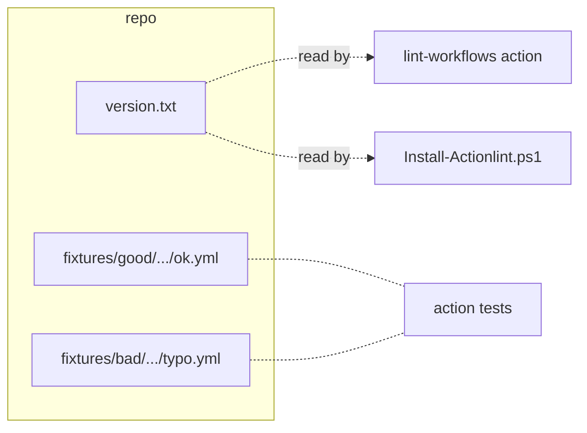
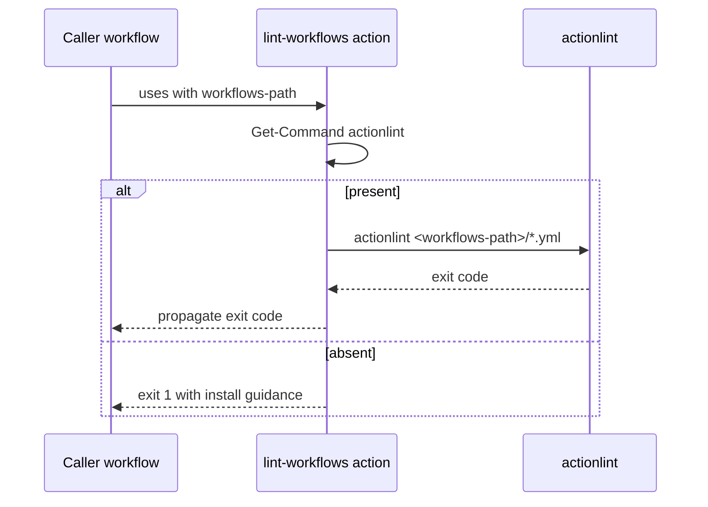
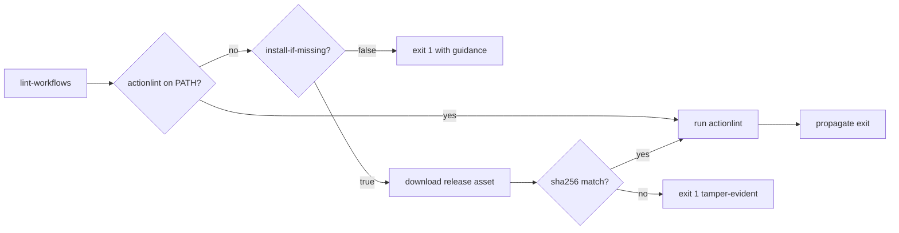
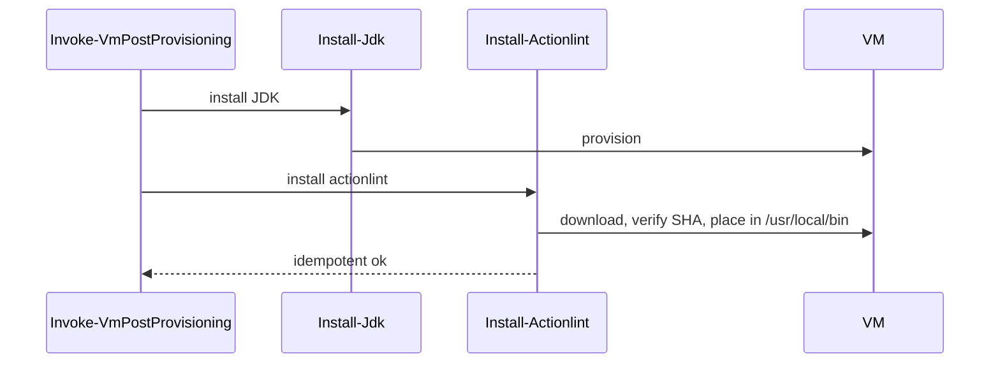
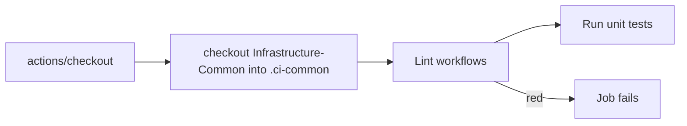
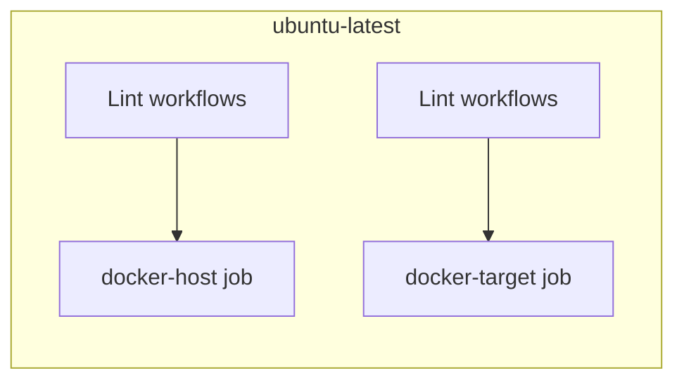
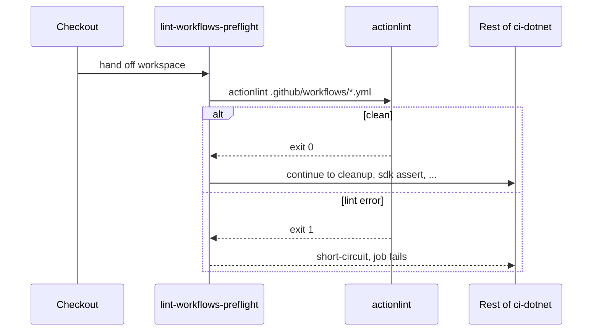

# Plan - Reusable workflow lint across PS and .NET CI

See [problem.md](problem.md) for context, scope, constraints, and
done criteria. Each step below is a single commit. Tests for each
step are listed under the step; integration tests that need a real
runner are called out explicitly and run via a draft PR. READMEs in
each touched repo are updated as part of the step that changes
user-visible behavior.

## Index
- [Step 1 - Pin actionlint version and stage fixture workflows](#step-1---pin-actionlint-version-and-stage-fixture-workflows)
- [Step 2 - `lint-workflows` composite action (PATH-hit path)](#step-2---lint-workflows-composite-action-path-hit-path)
- [Step 3 - `lint-workflows` download fallback path](#step-3---lint-workflows-download-fallback-path)
- [Step 4 - Provision actionlint on self-hosted Ubuntu VM image](#step-4---provision-actionlint-on-self-hosted-ubuntu-vm-image)
- [Step 5 - Tagged release of Infrastructure-Common](#step-5---tagged-release-of-infrastructure-common)
- [Step 6 - Wire preflight into `ci-powershell.yml`](#step-6---wire-preflight-into-ci-powershellyml)
- [Step 7 - Wire preflight into the docker-host/target workflows](#step-7---wire-preflight-into-the-docker-hosttarget-workflows)
- [Step 8 - Wire preflight into DotNet-Common `ci-dotnet.yml`](#step-8---wire-preflight-into-dotnet-common-ci-dotnetyml)
- [Cross-cutting notes](#cross-cutting-notes)

---

## Step 1 - Pin actionlint version and stage fixture workflows

**Reason:** Subsequent steps (action body, image install, every wire-in)
all need to agree on a single `actionlint` version, and the action's
own tests need fixture workflow files to lint. Landing both in one
prep commit keeps every later step's diff focused on its own concern.

**Changes:**
- New file
  `Infrastructure-Common/.github/actions/lint-workflows/version.txt`
  containing the pinned actionlint version (e.g. `1.7.12`, the
  version proved out locally). Single source of truth read by both
  the action's download path and `Install-Actionlint.ps1`.
- New fixture workflows under
  `Infrastructure-Common/Tests/Unit/lint-workflows/fixtures/`:
  - `good/.github/workflows/ok.yml` - a minimal workflow `actionlint`
    accepts cleanly.
  - `bad/.github/workflows/typo.yml` - same workflow with an
    intentional typo (e.g. `runs_on:` underscore) that `actionlint`
    reports.

**Tests (this step is data, not logic):**
- `actionlint <pinned version>` locally accepts `good/...` and
  rejects `bad/...` with a non-zero exit. Documents the contract the
  action's tests will rely on.

---

## Step 2 - `lint-workflows` composite action (PATH-hit path)

**Reason:** Land the smallest useful action first: the path where
`actionlint` is already on `PATH` (self-hosted runner with image
install, or local dev box). This isolates the action's body from
the download logic so each surface fails in its own commit if it
fails.

**Changes:**
- `Infrastructure-Common/.github/actions/lint-workflows/action.yml`
  - Inputs: `workflows-path` (default `.github/workflows`),
    `working-directory` (default `${{ github.workspace }}`),
    `install-if-missing` (default `true`, ignored in this step -
    placeholder for Step 3 to fill in).
  - Single `shell: pwsh` step delegating to
    `Invoke-WorkflowLint.ps1`.
- `Infrastructure-Common/.github/actions/lint-workflows/Invoke-WorkflowLint.ps1`
  - Resolves `actionlint` via `Get-Command`; if absent, fails with a
    diagnostic naming `Install-Actionlint.ps1` and pointing at
    `Infrastructure-Vm-Provisioner` (Step 3 swaps the failure for
    the download path).
  - Runs `actionlint` against
    `<working-directory>/<workflows-path>/*.yml` and propagates the
    exit code.
- Tests under
  `Infrastructure-Common/Tests/Unit/lint-workflows/Invoke-WorkflowLint.Tests.ps1`:
  - Mock `Get-Command` to simulate present/absent.
  - Mock `actionlint` invocation (function shim) to simulate exit 0
    and exit non-zero.
  - Assert: present + exit 0 -> action exits 0; present + exit 1 ->
    action exits 1 and surfaces the linter's stderr; absent ->
    action exits 1 with the diagnostic message.
- `Infrastructure-Common/README.md`: document the new action under
  the composite-actions list with its inputs and the path-hit
  requirement (download fallback documented in Step 3).

**Integration test (manual until Step 6 wires it in):**
- From the repo root with `actionlint` on `PATH`, run the action's
  script against the `fixtures/good/` directory; expect exit 0.
- Same against `fixtures/bad/`; expect exit non-zero and the typo
  surfaced on stdout.

---

## Step 3 - `lint-workflows` download fallback path

**Reason:** Hosted runners (`windows-latest`, `ubuntu-latest`) cannot
take an image-baked install. Without a fallback the action would
fail on every hosted-runner caller, which is most of Infrastructure-
Common's surface. Splitting this from Step 2 keeps the diff
focused and lets the path-hit tests stay simple.

**Changes:**
- Update `Invoke-WorkflowLint.ps1`:
  - When `Get-Command` misses and `-InstallIfMissing` is `$true`,
    download the platform-matching `actionlint` release asset from
    `https://github.com/rhysd/actionlint/releases/download/v<ver>/`
    into `${{ runner.temp }}/actionlint-<ver>/`, verify the SHA-256
    against an expected hash bundled with `version.txt` (sibling
    file `version.sha256`), extract, and use the resulting binary.
  - Platform selection via `$IsWindows`/`$IsLinux` -> Windows AMD64
    `.zip` vs Linux AMD64 `.tar.gz`.
  - If `-InstallIfMissing` is `$false` and `actionlint` is absent,
    fail with the Step 2 diagnostic (kept for the self-hosted
    "should already be installed" failure mode).
- Add `version.sha256` next to `version.txt`; document the bump
  procedure (download, verify upstream signatures, record the
  SHA-256) in a top-of-file comment.
- Extend tests:
  - Mock the download cmdlet; assert correct URL + filename per
    platform.
  - Assert SHA mismatch -> exit non-zero with a tamper-evident
    diagnostic.
  - Assert `-InstallIfMissing:$false` + absent -> the Step 2
    "install guidance" diagnostic, unchanged.
- `Infrastructure-Common/README.md`: extend the action's
  documentation to describe the fallback, the SHA verification, and
  the `install-if-missing` knob.

---

## Step 4 - Provision actionlint on self-hosted Ubuntu VM image

**Reason:** Self-hosted runners hit `actionlint` on PATH per the
existing tool-provisioning pattern (mirrors JDK), keeping the
hosted-only download path off the .NET CI hot path. Lands as its
own commit in `Infrastructure-Vm-Provisioner` so the VM-side change
is reviewable independently.

**Changes (in `Infrastructure-Vm-Provisioner`):**
- `hyper-v/ubuntu/up/post/Install-Actionlint.ps1` mirroring
  `Install-Jdk.ps1`:
  - Reads the version from a config field
    (`vm.tools.actionlintVersion`), with the same Read-VmConfig
    surface JDK uses.
  - Downloads the Linux AMD64 release asset, verifies SHA-256,
    extracts to `/usr/local/bin/actionlint`, `chmod +x`.
  - Idempotent: skips re-download if the installed binary's
    `--version` already matches.
- `hyper-v/ubuntu/up/post/Uninstall-Actionlint.ps1` (mirrors
  `Uninstall-Jdk.ps1`).
- `hyper-v/ubuntu/up/post/Invoke-VmPostProvisioning.ps1` invokes
  `Install-Actionlint.ps1` after `Install-Jdk.ps1`.
- Pester tests under `Tests/up/post/Install-Actionlint.Tests.ps1`
  mirroring `Install-Jdk.Tests.ps1`'s coverage shape
  (idempotency, version mismatch -> reinstall, download failure ->
  fail loud, SHA mismatch -> fail loud).
- `Infrastructure-Vm-Provisioner/README.md`: document the new tool
  in the "Post-provisioning software" section where JDK is listed.

**Integration test:**
- Reprovision a scratch VM via the standard up/down flow; SSH in and
  confirm `actionlint --version` prints the pinned version.

---

## Step 5 - Tagged release of Infrastructure-Common

**Reason:** DotNet-Common's `ci-dotnet.yml` (Step 8) pins by commit
SHA per its supply-chain posture. The SHA only exists once the tag
is cut. Lands before the consumer wire-ins so they pin to a real
reference rather than to `@master`.

**Changes:**
- Annotated tag (next minor; if the current is `v0.x.y`, this is
  `v0.{x+1}.0` because a new public action is additive but
  user-facing).
- Push tag to remote.
- `Infrastructure-Common/README.md`: list the new tag in the
  release notes section and reiterate the SHA-pinning guidance for
  consumers.

**Tests:**
- `git show <tag>` resolves and contains the action directory.
- Local dry-run: a scratch workflow that does
  `uses: VitaliiAndreev/Infrastructure-Common/.github/actions/lint-workflows@<sha>`
  resolves successfully when invoked from a throwaway branch in a
  consumer repo.

---

## Step 6 - Wire preflight into `ci-powershell.yml`

**Reason:** This is the most-used PS CI workflow; landing it first
proves the action works on `windows-latest` (the hosted-Windows
class) and exercises the download fallback on every run. Until
hosted runners cache `actionlint` somewhere, this is also the
canonical measure of per-job download overhead.

**Changes (in `Infrastructure-Common`):**
- Add a new step to `ci-powershell.yml` immediately after the
  existing `.ci-common` checkout (so the action's script is on
  disk) and before the unit-test step:
  - `name: Lint workflows`
  - Calls the local script
    `.ci-common/.github/actions/lint-workflows/Invoke-WorkflowLint.ps1`
    against `${{ github.workspace }}/.github/workflows` (the
    consumer's workflows, not Infrastructure-Common's).
- `Infrastructure-Common/README.md`: document the lint preflight in
  the `ci-powershell.yml` section.

**Tests:**
- Local dry-run: from a Windows shell, run the action's script
  against this repo's own `.github/workflows/` (where it is now
  green per the work we already did); expect exit 0.
- Draft PR with an intentional workflow typo on a scratch branch;
  the job goes red at the lint step with the typo surfaced in the
  log; revert.
- Confirm per-job cold-start overhead (download + lint) is under
  ~15 seconds on `windows-latest`; record it in the README.

---

## Step 7 - Wire preflight into the docker-host/target workflows

**Reason:** Same wiring as Step 6, but the runner class is
`ubuntu-latest`, which validates the Linux download path of the
action. Splitting from Step 6 keeps each runner-class proof its own
commit so a regression on either platform is bisectable.

**Changes (in `Infrastructure-Common`):**
- Add the lint step to `ci-powershell-docker-host.yml` and
  `ci-powershell-docker-target.yml`, in the same position relative
  to the existing `.ci-common` checkout.
- `Infrastructure-Common/README.md`: extend each workflow's section
  with the lint preflight note.

**Tests:**
- Same shape as Step 6 but on a Linux runner; record per-job
  overhead alongside the Windows number.

---

## Step 8 - Wire preflight into DotNet-Common `ci-dotnet.yml`

**Reason:** Exercises the self-hosted Ubuntu path (image-baked
`actionlint`, no download). Lands last so the image install (Step
4) has time to propagate to the runner fleet before the workflow
becomes a hard dependency on it.

**Changes (in `DotNet-Common`):**
- New composite action `.github/actions/lint-workflows-preflight/`
  (single-step wrapper) that does
  `uses: VitaliiAndreev/Infrastructure-Common/.github/actions/lint-workflows@<sha>`,
  pinned to the SHA from Step 5. Wrapping keeps the SHA reference
  in one place rather than duplicated across the local/consumer
  step pair below.
- Add the wrapper to `ci-dotnet.yml` as the first job step after
  `actions/checkout`, with the local/consumer `if:`-guarded
  duplicate pair that already governs every other step in this
  workflow.
- `DotNet-Common/README.md`: document the lint preflight in the
  ordered job-step list (it becomes step 2, pushing the existing
  cleanup to step 3, etc.).

**Tests:**
- Self-test workflow goes green on a self-hosted Ubuntu runner
  (validates the image-bake path with `install-if-missing: false`
  passed through so a missing tool reports the image-bake guidance
  rather than silently downloading).
- Temporarily break a workflow YAML; confirm the lint step fails
  and the rest of the job is short-circuited; revert.

---

## Cross-cutting notes
- One `actionlint` version pin (`version.txt`) is read by the action
  and `Install-Actionlint.ps1`. Bumping the version is one PR
  touching that file plus `version.sha256` and the JDK-equivalent
  Pester fixture.
- Every consumer wire-in step ends with a green CI run and updated
  README in the touched repo.
- If `actionlint` reports a finding in any existing workflow during
  rollout, the fix is a separate commit that lands *before* the
  wire-in step for that repo (don't bundle lint-driven fixes with
  the wire-in, so a bisect on a future regression is clean).
- If during execution something outside this plan is requested,
  append it as a new step here before acting.
